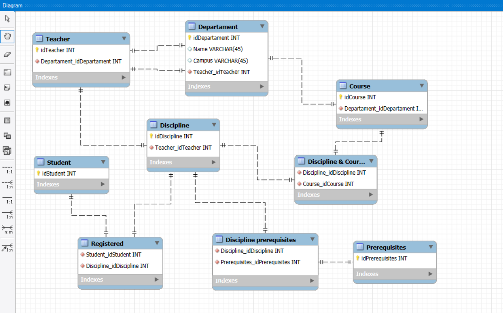
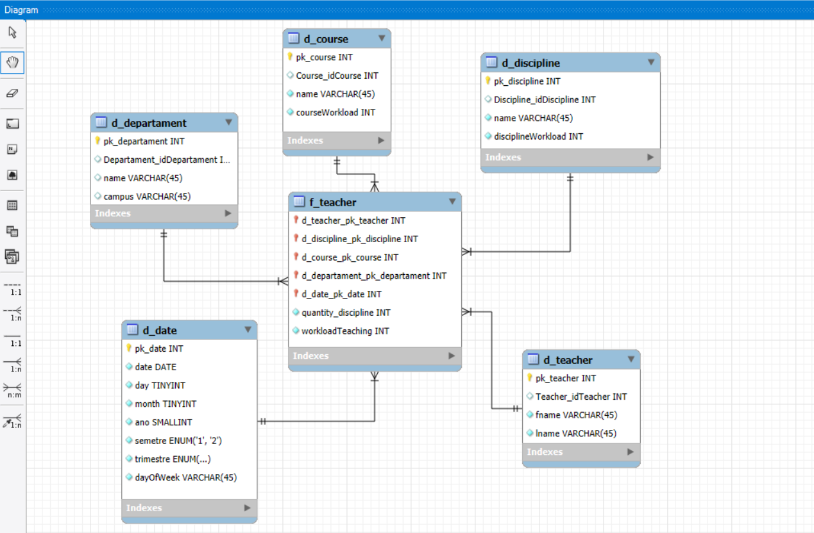

# Desafio de Modelagem Dimensional - Análise de Professores

Desafio de modelagem de dados que consiste na transformação de um diagrama relacional em um modelo dimensional(Star Schema).

---

## 1. Modelo Relacional (Ponto de Partida)

Este foi o diagrama EER original fornecido, otimizado para transações e normalizado.

---

## 2. Modelo Dimensional (Resultado Final)

Este é o *Star Schema* desenvolvido, otimizado para análise. O modelo é composto pela tabela fato f_teacher (focada nos eventos de ensino) e 5 tabelas dimensão que fornecem o contexto (d_teacher, d_discipline, d_course, d_departament, d_date).

---

## 🛠️ Ferramentas

* MySQL Workbench